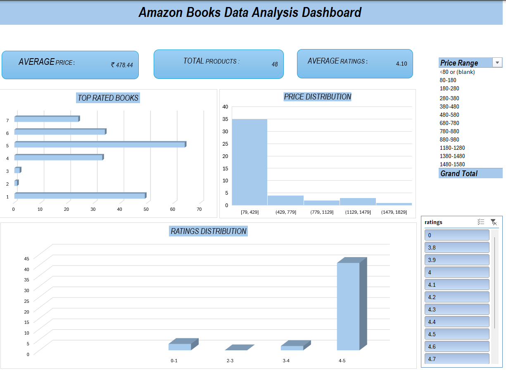

# 📚 Amazon Books Web Scraping & Data Analysis Project (Excel)

## 📌 Project Overview

This project demonstrates my end-to-end data analytics workflow using Microsoft Excel.

The dataset was collected through web scraping of Amazon Books data and analyzed using Excel tools such as Pivot Tables, Power Query, and Interactive Dashboard components.

The goal of this project is to showcase my data cleaning, transformation, and visualization skills.

---

## 🔍 Project Objectives

- Extract and analyze Amazon Books data
- Clean and transform raw scraped data
- Create interactive visual dashboard
- Generate meaningful business insights

---

## 🛠 Tools & Technologies Used

- Microsoft Excel
- Power Query
- Pivot Tables
- Slicers
- Data Cleaning Techniques
- Web Scraping (data source)

---

## 🧹 Data Cleaning & Preparation

The following preprocessing steps were performed:

- ✔ Removed duplicate records  
- ✔ Removed blank/null values  
- ✔ Replaced inconsistent values  
- ✔ Cleaned and formatted columns  
- ✔ Standardized price and rating fields  
- ✔ Data transformation using Power Query  

These steps ensured the dataset was accurate, consistent, and ready for analysis.

---

## 📊 Data Analysis Techniques Used

- Pivot Tables for summarization
- Aggregation of ratings and prices
- Price range categorization
- Rating distribution grouping
- KPI calculations (Average Price, Average Rating, Total Products)

---

## 📈 Dashboard Features

The interactive dashboard includes:

- 📌 Average Price KPI  
- 📌 Average Rating KPI  
- 📌 Total Products Count  
- 📊 Price Distribution Histogram  
- 📊 Ratings Distribution Chart  
- 📊 Top Rated Books  
- 🎛 Interactive Slicers for filtering  

The dashboard allows dynamic filtering and visual analysis.

---

## 📷 Dashboard Preview

---

## 💡 Key Insights

- Majority of books fall within the 4–5 rating range  
- Most books are priced below ₹500  
- Higher rated books tend to cluster in mid-price range  

---

## 🎯 Skills Demonstrated

- Data Cleaning & Preprocessing
- Data Transformation (Power Query)
- Exploratory Data Analysis (EDA)
- Dashboard Design
- Business Insight Generation
- Excel Data Visualization
- Structured Reporting

---

## 🚀 Project Purpose

This project was created to demonstrate my practical knowledge of data analytics using Excel, including:

- Handling real-world messy data
- Transforming raw scraped data into meaningful insights
- Building interactive dashboards for decision-making

---

